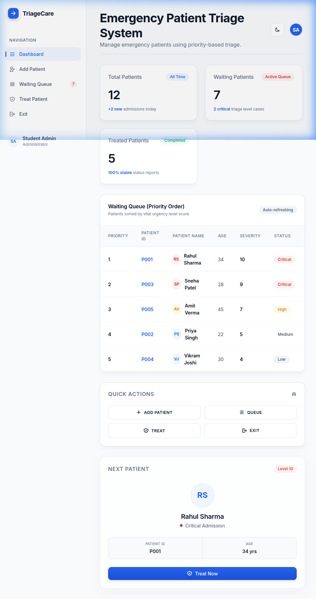
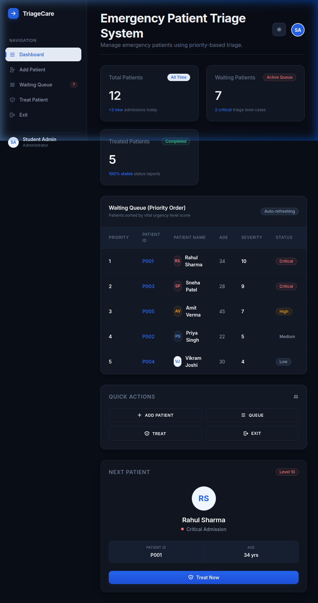
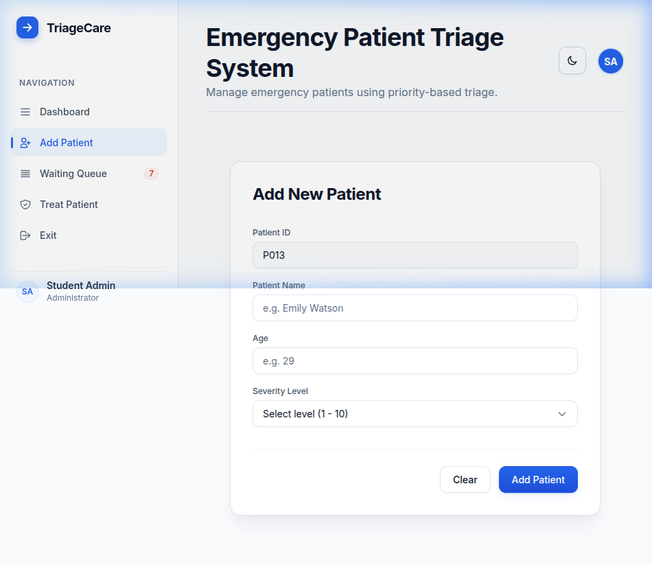
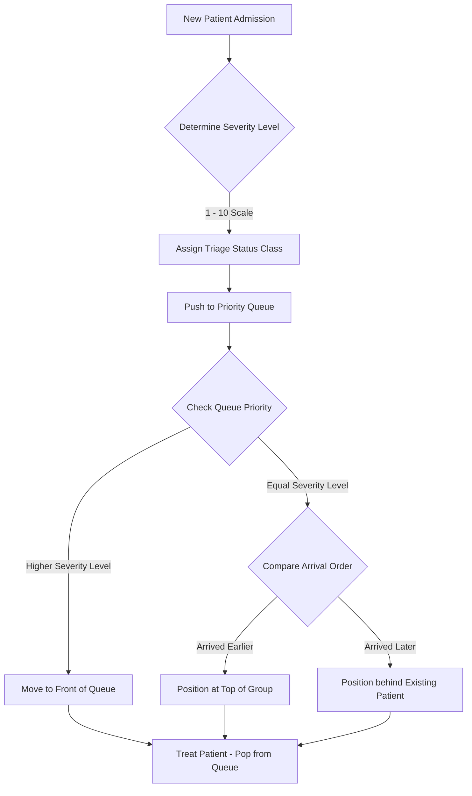

# 🏥 TriageCare: Emergency Room Patient Triage System

[](https://en.cppreference.com/w/cpp/17)
[](https://developer.mozilla.org/en-US/)
[](design-system-spec.md)
[](#-ui-preview)

**TriageCare** is an emergency room triage and patient management system. It simulates clinical triage operations through a dual-channel architecture: a high-fidelity **Vanilla Web Dashboard** and a corresponding **C++ CLI Backend Application**. 

Both systems implement a priority-based queue where incoming patients are triaged dynamically based on the clinical severity of their vitals, ensuring critical cases receive immediate medical attention.

---

## 📸 UI Preview

TriageCare features a premium, responsive layout that supports both light and dark modes with glassmorphic cards, smooth hover lift actions, and reactive status indications.

### Dark Theme Dashboard


### Treat Patient


### Dynamic Patient Admission


---

## 🛠️ System Architecture

TriageCare runs a deterministic sorting algorithm on both platforms to model emergency triage queues:



### Key Technical Pillars

1. **Deterministic Triage Logic**: Patients are sorted by severity score ($10 \rightarrow \text{most critical}$, $1 \rightarrow \text{least critical}$). In the event of matching severity scores, priority is given to the patient with the earlier arrival order (FCFS - First Come, First Served).
2. **Stateless Frontend Synchronization**: Since the web pages are separate static HTML files, they share state via **Base64-serialized URL parameters** (`?s=...`) coupled with a **LocalStorage fallback**, allowing full navigation consistency without a stateful server.
3. **Responsive CSS Design Token System**: Outlined in `design-system-spec.md`, the UI uses CSS variable tokens for radius, padding, elevation, and theme-dependent color scales to support seamless theme toggling.

---

## 🖥️ C++ Core Engine (CLI Backend)

The C++ source in `main.cpp` represents a object-oriented implementation matching the frontend logic exactly.

### Classes Implemented

- **`Patient`**: Encapsulates clinical variables including Patient ID, Name, Age, Severity Score, and Arrival Order index. It overloads the standard `operator<` to determine custom queue hierarchy:
  ```cpp
  bool operator<(const Patient& other) const {
      if (this->severity != other.severity) {
          return this->severity < other.severity; // Max-heap: Higher severity at top
      }
      return this->arrivalOrder > other.arrivalOrder; // Min-heap: Smaller arrival order at top
  }
  ```
- **`Hospital`**: Manages the `std::priority_queue<Patient>` container, tracks overall admitted/treated statistics, and exposes operational methods.
- **`Doctor` & `Ward`**: Placeholder objects modeling emergency medical resources (e.g. Lead Surgeon and bed availability).

### Compilation & Running (C++ CLI)

Compile the C++ source using `g++` or any C++17 compatible compiler:

```bash
# Compile
g++ -std=c++17 main.cpp -o TriageCareBackend

# Execute
./TriageCareBackend
```

#### Interactive CLI Controls
1. **`1. Add Patient`**: Input patient demographics and vital severity (1-10) to insert them into the queue.
2. **`2. Waiting Queue`**: Print the current priority sorted queue.
3. **`3. Treat Patient`**: Treats the patient at the top of the queue.
4. **`4. Exit`**: Exit confirmation sub-menu.

---

## 🌐 Web Dashboard (Frontend)

The frontend is built on vanilla web standards without external dependencies, focusing on micro-animations and accessibility.

### Page Routes

- **`index.html` (Dashboard)**: Displays primary emergency metrics, quick shortcuts, the current Top 5 emergency list, and detailed vital information for the next patient in queue.
- **`add-patient.html`**: Clean administrative admission intake form with input constraints.
- **`waiting-queue.html`**: A full tabular view of all patients currently waiting in the ward, including visual capsule badges.
- **`treat-patient.html`**: The physician command room. Features a focal patient avatar layout and treatment controls.
- **`exit.html`**: Interactive confirmation dialog simulation.

### Stateless Base64 State Manager

In `app-state.js`, the state is serialized into a lightweight JSON string, compressed, and encoded into Base64 format. Navigating between views calls `TriageState.navigateTo(url)`, appending the payload:

$$\text{URL} \rightarrow \text{page.html?s=e30...}$$

If the query string is absent, the system restores the state from `localStorage` or seeds default metrics.

---

## 📁 Repository Structure

```markdown
TriageCare/
├── assets/                    # Project UI screenshots
│   ├── dashboard-light.png
│   ├── dashboard-dark.png
│   └── add-patient-light.png
├── design-system.css          # Core CSS variables, classes, and layouts
├── design-system-spec.md      # Detailed documentation of HTML/CSS code tokens
├── app-state.js               # In-memory JS controller & state parser
├── main.cpp                   # C++ Backend Priority Queue CLI Application
├── index.html                 # Dashboard main screen
├── add-patient.html           # Admission form screen
├── waiting-queue.html         # Active queue list screen
├── treat-patient.html         # Patient treatment panel
├── exit.html                  # Log out / Exit confirmation page
└── README.md                  # This project overview document
```

---

## 🎨 Theme & Customization Specs

TriageCare uses standard CSS custom properties (`--tc-color-*`) mapping to the theme context. Switching attributes toggles light/dark values:

```js
// Toggle theme dynamically from JavaScript
document.documentElement.setAttribute('data-theme', 'dark');  // Switch to Dark Theme
document.documentElement.removeAttribute('data-theme');       // Switch to Light Theme
```

> [!NOTE]
> The custom variables auto-adjust properties such as `box-shadow` values, borders, text color weightings, and card backgrounds dynamically to preserve premium readability.

---

> Created for TriageCare emergency room simulations. Distributed under educational license agreements.
